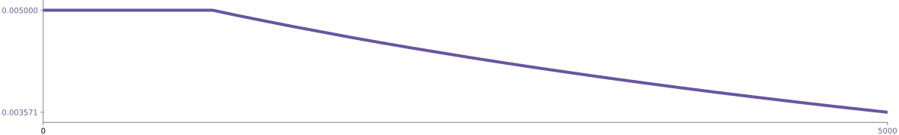
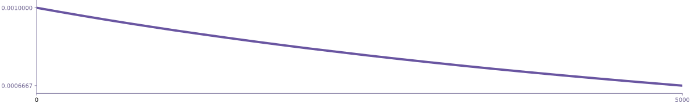
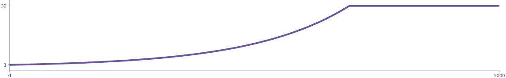
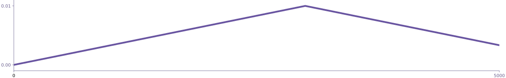
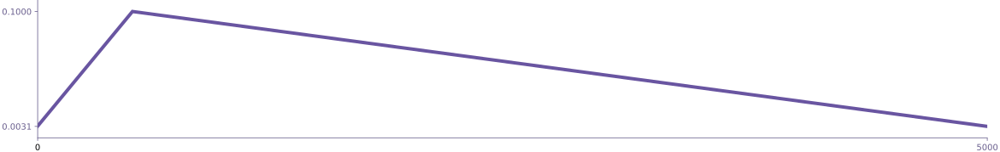
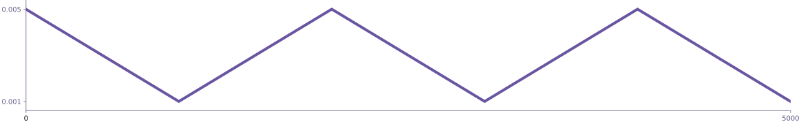

Schedules are generators that provide different rates, schedules, decays or
series. They're typically used for batch sizes or learning rates. You can easily
implement your own schedules as well: just write your own generator function,
that produces whatever series of values you need. A common use case for
schedules is within [`Optimizer`](/docs/api-optimizer) objects, which accept
iterators for most of their parameters. See the
[training guide](/docs/usage-training) for details.

## constant {#constant tag="function"}

Yield a constant rate.


<grid>

```python
### {small="true"}
from thinc.api import constant

batch_sizes = constant(0.001)
batch_size = next(batch_sizes)
```

```ini
### config {small="true"}
[batch_size]
@schedules = "constant.v1"
rate = 0.001
```

</grid>

| Argument   | Type           |
| ---------- | -------------- |
| `rate`     | <tt>float</tt> |
| **YIELDS** | <tt>float</tt> |

## constant_then {#constant_then tag="function"}

Yield a constant rate for N steps, before starting a schedule.



<grid>

```python
### {small="true"}
from thinc.api import constant_then, decaying

learn_rates = constant_then(
    0.005,
    1000,
    decaying(0.005, 1e-4)
)
learn_rate = next(learn_rates)
```

```ini
### config {small="true"}
[learn_rates]
@schedules = "constant_then.v1"
rate = 0.005
steps = 1000

[learn_rates.schedule]
@schedules = "decaying"
base_rate = 0.005
decay = 1e-4
```

</grid>

| Argument   | Type                     |
| ---------- | ------------------------ |
| `rate`     | <tt>float</tt>           |
| `steps`    | <tt>int</tt>             |
| `schedule` | <tt>Iterable[float]</tt> |
| **YIELDS** | <tt>float</tt>           |

## decaying {#decaying tag="function"}

Yield an infinite series of linearly decaying values, following the schedule
`base_rate * 1 / (1 + decay * t)`.



<grid>

```python
### {small="true"}
from thinc.api import decaying

learn_rates = decaying(0.005, 1e-4)
learn_rate = next(learn_rates)  # 0.001
learn_rate = next(learn_rates)  # 0.00999
```

```ini
### config {small="true"}
[learn_rate]
@schedules = "decaying.v1"
base_rate = 0.005
decay = 1e-4
t = 0
```

</grid>

| Argument       | Type           |
| -------------- | -------------- |
| `base_rate`    | <tt>float</tt> |
| `decay`        | <tt>float</tt> |
| _keyword-only_ |                |
| `t`            | <tt>int</tt>   |
| **YIELDS**     | <tt>float</tt> |

## compounding {#compounding tag="function"}

Yield an infinite series of compounding values. Each time the generator is
called, a value is produced by multiplying the previous value by the compound
rate.



<grid>

```python
### {small="true"}
from thinc.api import compounding

batch_sizes = compounding(1.0, 32.0, 1.001)
batch_size = next(batch_sizes)  # 1.0
batch_size = next(batch_sizes)  # 1.0 * 1.001
```

```ini
### config {small="true"}
[batch_size]
@schedules = "compounding.v1"
start = 1.0
stop = 32.0
compound = 1.001
t = 0
```

</grid>

| Argument       | Type           |
| -------------- | -------------- |
| `start`        | <tt>float</tt> |
| `stop`         | <tt>float</tt> |
| `compound`     | <tt>float</tt> |
| _keyword-only_ |                |
| `t`            | <tt>int</tt>   |
| **YIELDS**     | <tt>float</tt> |

## warmup_linear {#warmup_linear tag="function"}

Generate a series, starting from an initial rate, and then with a warmup period,
and then a linear decline. Used for learning rates.



<grid>

```python
### {small="true"}
from thinc.api import warmup_linear

learn_rates = warmup_linear(0.01, 3000, 6000)
learn_rate = next(learn_rates)
```

```ini
### config {small="true"}
[learn_rate]
@schedules = "warmup_linear.v1"
initial_rate = 0.01
warmup_steps = 3000
total_steps = 6000
```

</grid>

| Argument       | Type           |
| -------------- | -------------- |
| `initial_rate` | <tt>float</tt> |
| `warmup_steps` | <tt>int</tt>   |
| `total_steps`  | <tt>int</tt>   |
| **YIELDS**     | <tt>float</tt> |

## slanted_triangular {#slanted_triangular tag="function"}

Yield an infinite series of values according to
[Howard and Ruder's (2018)](https://arxiv.org/abs/1801.06146) "slanted
triangular learning rate" schedule.



<grid>

```python
### {small="true"}
from thinc.api import slanted_triangular

learn_rates = slanted_triangular(0.1, 5000)
learn_rate = next(learn_rates)
```

```ini
### config {small="true"}
[learn_rate]
@schedules = "slanted_triangular.v1"
max_rate = 0.1
num_steps = 5000
cut_frac = 0.1
ratio = 32
decay = 1.0
t = 0.1
```

</grid>

| Argument       | Type           |
| -------------- | -------------- |
| `max_rate`     | <tt>float</tt> |
| `num_steps`    | <tt>int</tt>   |
| _keyword-only_ |                |
| `cut_frac`     | <tt>float</tt> |
| `ratio`        | <tt>int</tt>   |
| `decay`        | <tt>float</tt> |
| `t`            | <tt>float</tt> |
| **YIELDS**     | <tt>float</tt> |

## cyclic_triangular {#cyclic_triangular tag="function"}

Linearly increasing then linearly decreasing the rate at each cycle.



<grid>

```python
### {small="true"}
from thinc.api import cyclic_triangular

learn_rates = cyclic_triangular(0.005, 0.001, 1000)
learn_rate = next(learn_rates)
```

```ini
### config {small="true"}
[learn_rate]
@schedules = "cyclic_triangular.v1"
min_lr = 0.005
max_lr = 0.001
period = 1000
```

</grid>

| Argument   | Type           |
| ---------- | -------------- |
| `min_lr`   | <tt>float</tt> |
| `max_lr`   | <tt>float</tt> |
| `period`   | <tt>int</tt>   |
| **YIELDS** | <tt>float</tt> |
