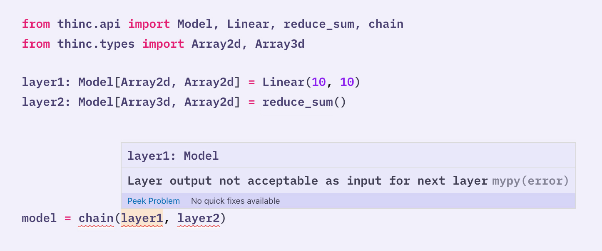

Thinc is a **lightweight deep learning library** that offers an elegant,
type-checked, functional-programming API for **composing models**, with support
for layers defined in other frameworks such as **PyTorch**, **TensorFlow** or
**MXNet**. You can use Thinc as an interface layer, a standalone toolkit or a
flexible way to develop new models. Previous versions of Thinc have been running
quietly in production in thousands of companies, via both
[spaCy](https://spacy.io) and [Prodigy](https://prodi.gy). We wrote the new
version to let users **compose, configure and deploy custom models** built with
their favorite framework. The end result is a library quite different in its
design, that's easy to understand, plays well with others, and is a lot of fun
to use.

---

<grid layout="feature">

<div>
<code-screenshot>

[](/docs/usage-type-checking)

</code-screenshot>
</div>

<small>

##### Type-check your model definitions

with custom types and [`mypy`](https://mypy.readthedocs.io/en/stable/) plugin

<button to="/docs/usage-type-checking">Read more</button>

</small>

```python
### {small="true"}
from thinc.api import PyTorchWrapper, TensorFlowWrapper

pt_model = PyTorchWrapper(create_pytorch_model())
tf_model = TensorFlowWrapper(create_tensorflow_model())
# You can even stitch together strange hybrids
# (not efficient, but possible)
frankenmodel = chain(add(pt_model, tf_model), Linear(128), logistic())
```

<small>

##### Wrap PyTorch, TensorFlow & MXNet models for use in your network

<button to="/docs/usage-frameworks">Read more</button>

</small>

```python
### {small="true"}
def CaptionRater(
    text_encoder: Model[List[str], Floats2d],
    image_encoder: Model[List[Path], Floats2d]
) -> Model[Tuple[List[str], List[Path]], Floats2d]:
    return chain(
        concatenate(
          chain(get_item(0), text_encoder),
          chain(get_item(1), image_encoder)
        ),
        residual(Relu(nO=300, dropout=0.2, normalize=True)),
        Softmax(2)
    )
```

<small>

##### Concise functional-programming approach to model definition

using composition rather than inheritance

<button to="/docs/usage-models">Read more</button>

</small>

```python
### {small="true"}
apply_on = lambda layer, i: chain(getitem(i), layer)
with Model.define_operators({"^": apply_on, ">>": chain, "|": concatenate}):
    model = (
        (text_encoder ^ 0 | image_encoder ^ 1)
        >> residual(Relu(nO=300, dropout=0.2, normalize=True)
        >> Softmax(2)
    )
```

<small>

##### Optional custom infix notation via operator overloading

<button to="/docs/usage-models#operators">Read more</button>

</small>

```ini
### {small="true"}
[optimizer]
@optimizers = "Adam.v1"

[optimizer.learn_rate]
@schedules = "slanted_triangular.v1"
max_rate = 0.1
num_steps = 5000
```

<small>

##### Integrated config system

to describe trees of objects and hyperparameters

<button to="/docs/usage-config">Read more</button>

</small>

<!-- TODO: add one or two more lines to example -->

```python
### {small="true"}
from thinc.api import NumpyOps, set_current_ops

def CustomOps(NumpyOps):
    def some_custom_op_my_layers_needs(...):
        ...
set_current_ops(CustomOps())
```

<small>

##### Choice of extensible backends

<button to="/docs/api-backends">Read more</button>

</small>

```python
### {small="true"}
encode_sentence = chain(
    list2ragged(),  # concatenate sequences
    with_array(  # ignore outer sequence structure (temporarily)
        concatenate(Embed(128, column=0), Embed(128, column=1)),
        Mish(128, dropout=0.2, normalize=True)
    ),
    ParametricAttention(128),
    reduce_mean()
)
```

<small>

##### First-class support for variable-length sequences

multiple built-in sequence representations and your layers can use any object

<button to="/docs/usage-sequences">Read more</button>

</small>

```python
### {small="true"}
for i in range(10):
    for X, Y in train_batches:
        Yh, backprop = model.begin_update(X)
        loss, dYh = get_loss(Yh, Y)
        backprop(dYh)
        model.finish_update(optimizer)
```

<small>

##### Low abstraction training loop

<button to="/docs/usage-training">Read more</button>

</small>

</grid>

---

<!-- TODO: include more examples that we want to showcase -->

<tutorials>

- intro
- transformers_tagger
- parallel_training_ray

</tutorials>
