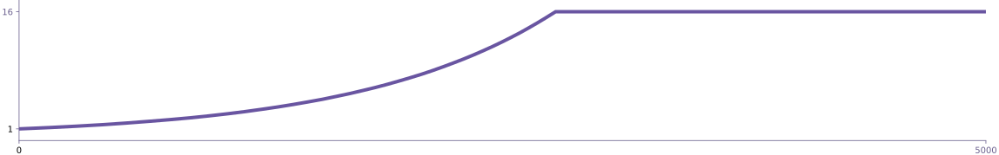
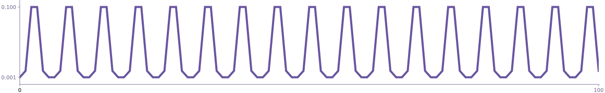

Thinc provides a fairly minimalistic approach to training, leaving you in
control to write the training loop. The library provides a few utilities for
minibatching, hyperparameter scheduling, loss functions and weight
initialization, but does not provide abstractions for data loading, progress
tracking or hyperparameter optimization.

## The training loop {#training-loop}

Thinc assumes that your model will be trained using some form of **minibatched
stochastic gradient descent**. On each step of a standard training loop, you'll
loop over batches of your data and call
[`Model.begin_update`](/docs/api-model#begin_update) on the inputs of the batch,
which will return a batch of predictions and a backpropagation callback. You'll
then calculate the gradient of the loss with respect to the output, and provide
it to the backprop callback which will increment the gradients of the model
parameters as a side-effect. You can then pass an optimizer function into the
[`Model.finish_update`](/docs/api-model#finish_update) method to update the
weights.

```python
### Basic training loop
for i in range(10):
    for X, Y in train_batches:
        Yh, backprop = model.begin_update(X)
        loss, dYh = get_loss_and_gradient(Yh, Y)
        backprop(dYh)
        model.finish_update(optimizer)
```

You'll usually want to make some additions to the loop to save out model
checkpoints periodically, and to calculate and report progress statistics. Thinc
also provides ready access to **lower-level details**, making it easy to
experiment with arbitrary training variations. You can accumulate the gradients
over multiple batches before calling the optimizer, call the `backprop` callback
multiple times (or not at all if the update is small), and inject arbitrary code
to change or report gradients for particular layers. The implementation is quite
transparent, so you'll find it easy to implement such arbitrary modifications if
you need to.

## Batching {#batching}

<infobox>

A "minibatch" (or simply "batch" – we use the terms interchangeably) is just a
group of samples that you update or predict over together. Batching the data is
very important: most neural network models converge much faster and achieve
better accuracy when the gradients are calculated using multiple samples.

</infobox>

Thinc implements two batching helpers via the backend object
[`Ops`](/docs/api-backend#ops), typically used via `model.ops`. They should
cover the most common batching needs for training and evaluation.

1. [`minibatch`](/docs/api-backends#minibatch): Iterate slices from a sequence,
   optionally shuffled.
2. [`multibatch`](/docs/api-backends#multibatch): Minibatch one or more
   sequences and yield lists with one batch per sequence.

```python
### Example
batches = model.ops.minibatch(128, data, shuffle=True)
batches = model.ops.multibatch(128, train_X, train_Y, shuffle=True)
```

The batching methods take sequences of data and process them as a stream. They
return a [`SizedGenerator`](/docs/api-types#sizedgenerator), a simple custom
dataclass for generators that has a `__len__` and can repeatedly call the
generator function. This also means that the batching works nicely with progress
bars like [`tqdm`](https://github.com/tqdm/tqdm) and similar tools
out-of-the-box.

```python
### With progress bar {highlight="1,4"}
from tqdm import tqdm

data = model.ops.multibatch(128, train_X, train_Y, shuffle=True)
for X, Y in tqdm(data, leave=False):
    Yh, backprop = model.begin_update(X)
```

[`SizedGenerator`](/docs/api-types#sizedgenerator) objects hold a reference to
the generator function and **call it repeatedly**, i.e. every time the sized
generator is executed. This also means that the sized generator is **never
consumed**. If you like, you can define it once outside your training loop, and
on each iteration, the data will be **rebatched and reshuffled**.

```python
### Option 1
for i in range(10):
    for X, Y in model.ops.multibatch(128, train_X, train_Y, shuffle=True):
        # Update the model here
    for X, Y in model.ops.multibatch(128, dev_X, dev_Y):
        # Evaluate the model here
```

```python
### Option 2
train_data = model.ops.multibatch(128, train_X, train_Y, shuffle=True)
dev_data = model.ops.multibatch(128, dev_X, dev_Y)
for i in range(10):
    for X, Y in train_data:
        # Update the model here
    for X, Y in dev_data:
        # Evaluate the model here
```

The `minibatch` and `multibatch` methods also support a `buffer` argument, which
may be useful to promote better parallelism. If you're using an engine that
supports asynchronous execution, such as PyTorch or
[JAX](https://github.com/google/jax), an unbuffered stream could cause the
engine to block unnecessarily. If you think this may be a problem, try setting a
higher buffer, e.g. `buffer=500`, and see if it solves the problem. You could
also simply consume the entire generator, by calling `list()` on it.

Finally, `minibatch` and `multibatch` support **variable length batching**,
based on a schedule you can provide as the `batch_size` argument. Simply pass in
an iterable (such as a generator from the
[built-in schedules](/docs/api-schedules)) instead of an integer. Variable
length batching is non-standard, but we regularly use it for some of
[spaCy](https://spacy.io)'s models, especially the parser and entity recognizer.

```python
from thinc.api import compounding

batch_size = compounding(1.0, 16.0, 1.001)
train_data = model.ops.multibatch(batch_size, train_X, train_Y, shuffle=True)
```



<grid>

```ini
### config {small="true"}
[batch_size]
@schedules = "compounding.v1"
start = 1.0
stop = 16.0
compound = 1.001
```

```python
### Usage {small="true"}
from thinc.api import Config, registry

config = Config().from_str("./config.cfg")
resolved = registry.resolve(config)
batch_size = resolved["batch_size"]
```

</grid>

---

## Evaluation {#evaluation}

Thinc does not provide utilities for calculating accuracy scores over either
individual samples or whole datasets. In most situations, you will make a loop
over batches of your inputs and targets, **calculate the accuracy** on the batch
of data, and then **keep a tally of the scores**.

```python
def evaluate(model, batch_size, Xs, Ys):
    correct = 0.
    total = 0.
    for X, Y in model.ops.multibatch(batch_size, Xs, Ys):
        correct += (model.predict(X).argmax(axis=0) == Y.argmax(axis=0)).sum()
        total += X.shape[0]
    return correct / total
```

During evaluation, take care to run your model **in a prediction context** (as
opposed to a training context), by using either the
[`Model.predict`](/docs/api-model#predict) method, or by passing the
`is_train=False` flag to [`Model.__call__`](/docs/api-model#call). Some layers
may behave differently during training and prediction in order to provide
regularization. Dropout layers are the most common example.

---

## Loss calculators {#losses}

When training your Thinc models, the most important loss calculation is not a
scalar loss, but rather the **gradient of the loss with respect to your model
output**. That's the figure you have to pass into the backprop callback. You
actually don't need to calculate the scalar loss at all, although it's often
helpful as a diagnostic statistic.

Thinc provides a few [helpers for common loss functions](/docs/api-losses). Each
helper is provided as a class, so you can pass in any settings or
hyperparameters that your loss might require. The helper class can be used as a
callable object, in which case it will return both the scalar loss and the
gradient of the loss with respect to the outputs. You can also call the
`get_grad` method to just get the gradients, or the `get_loss` method to just
get the scalar loss.

<grid>

```python
### Example {small="true"}
from thinc.api import CategoricalCrossentropy
loss_calc = CategoricalCrossentropy()
grad, loss = loss_calc(guesses, truths)
```

```ini
### config.cfg {small="true"}
[loss]
@losses = "CategoricalCrossentropy.v1"
normalize = true
```

</grid>

---

## Setting learning rate schedules {#schedules}

A common trick for stochastic gradient descent is to **vary the learning rate or
other hyperparameters** over the course of training. Since there are many
possible ways to vary the learning rate, Thinc lets you implement hyperparameter
schedules as simple generator functions. Thinc also provides a number of
[popular schedules](/docs/api-schedules) built-in.

You can use schedules directly, by calling `next()` on the schedule and using it
to update hyperparameters in your training loop. Since schedules are
particularly common for optimization settings, the
[`Optimizer`](/docs/api-optimizer) object accepts floats, lists and iterators
for most of its parameters. When you call
[`Optimizer.step_schedules`](/docs/api-optimizer#step_schedules), the optimizer
will draw the next value from the generators and use them to change the given
attributes. For instance, here's how to create an instance of the `Adam`
optimizer with a custom learning rate schedule:

```python
### Custom learning rate schedule
from thinc.api import Adam

def my_schedule():
    values = [0.001, 0.01, 0.1]
    while True:
        for value in values:
            yield value
        for value in reversed(values):
            yield value

optimizer = Adam(learn_rate=my_schedule())
assert optimizer.learn_rate == 0.001
optimizer.step_schedules()
assert optimizer.learn_rate == 0.01
optimizer.step_schedules()
assert optimizer.learn_rate == 0.1
```



You'll often want to describe your optimization schedules in your configuration
file. That's also very easy: you can use the
[`@thinc.registry.schedules`](/docs/api-config#registry) decorator to register
your function, and then refer to it in your config as the `learn_rate` argument
of the optimizer. Check out the
[documentation on config files](/docs/usage-config) for more examples.

<grid>

```python
### Registered function {small="true"}
@thinc.registry.schedules("my_schedule.v1")
def my_schedule(values):
    while True:
        for value in values:
            yield value
        for value in reversed(values):
            yield value
```

```ini
### config.cfg {small="true"}
[optimizer]
@optimizers = "Adam.v1"

[optimizer.learn_rate]
@schedules = "my_schedule.v1"
values = [0.001, 0.01, 0.1]
```

</grid>

---

## Distributed training {#distributed}

We expect to recommend [Ray](https://ray.io/) for distributed training. Ray
offers a clean and simple API that fits well with Thinc's model design. While
full support is still under development, you can find an example here:

<tutorials header="false">

- parallel_training_ray

</tutorials>
