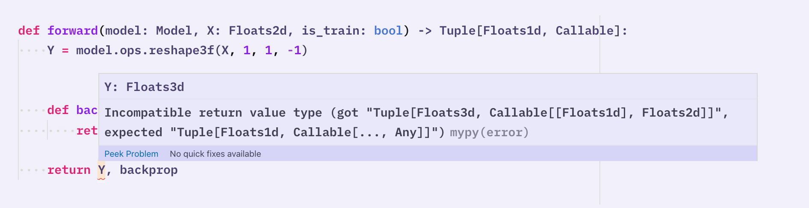

<!-- Intro concept on motivation: NN models are complex, you pass a bunch of
stuff around and have to deal with multi-dimensional arrays and hyperparameters.
If something goes wrong and there's a bug – like mismatched dimensions – it
causes headaches and potentially hours of debugging, because it's difficult to
inspect everything that goes on under the hood. Enter type annotations... -->

By this point you've probably seen that **Thinc** uses the new Python 3.6+
syntax for [**type hints**](https://docs.python.org/3/library/typing.html) or
"type annotations". All the code base is type-annotated and it is recommended
that you add at least **some types to your own code**, too. Type annotations can
make your numeric code much more explicit, making it easier to come back to
later. Type annotations also allow your editor (and many other tools) to perform
**type checks** _before_ executing your code. They also power
**autocompletion**. For example, if you try to add a `str` and an `int`, your
editor will probably warn you that it is an invalid operation, without having to
wait until you run the invalid code. It may also tell you that a function
expects a `float`, so you don't pass it an invalid type. If your layer is typed
as `Model[Floats2d, Ints1d]`, Thinc can tell you if its inputs and outputs are
incompatible with the rest of your network.

Thinc's type-system won't catch every error. It has no representation for the
sizes of your dimensions, so a lot of invalid operations can't be detected until
runtime. Sometimes the syntax gets quite ugly, and the error messages are often
frustratingly opaque. Nevertheless, we do recommend you try it out, especially
for your model definitions and the functions you're registering for the config
system.

## Installation and setup {#install}

[`mypy`](https://mypy.readthedocs.io/en/stable/) is the "standard" type checker
for Python, in fact, that's where these new Python type hints were born. You can
install `mypy` from pip or conda. If you use a virtual environment for your
project, make sure that you install it in the same environment.

<grid>

```bash
### pip {small="true"}
$ pip install mypy
```

```bash
### conda {small="true"}
$ conda install -c conda-forge mypy
```

</grid>

Thinc comes with a `mypy` plugin that **extends the normal functionality** to
perform additional type checks in code using Thinc. If you installed Thinc, you
already have the plugin. To enable the Thinc plugin for `mypy` you just have to
create a file `mypy.ini` within your project folder. This will tell `mypy` to
use the plugin in the module `thinc.mypy`. If you use
[`pydantic`](https://github.com/samuelcolvin/pydantic) for
[advanced configuration](/docs/usage-config#advanced-types), you can also enable
`pydantic`'s plugin. If you're using Thinc as part of your Python package, you
can also add the `[mypy]` section to your package's `setup.cfg`.

<grid>

```ini
### mypy.ini {small="true"}
[mypy]
plugins = thinc.mypy
```

```ini
### mypy.ini {small="true"}
[mypy]
plugins = thinc.mypy, pydantic.mypy
```

</grid>

To type check a file or directory, you can now use the `mypy` command:

```bash
$ mypy my_file.py
```

### Setting up linting in your editor {#linting}

Real-time linting is especially powerful, as it lets you type-check your code as
it leaves your fingers. This often lets you catch errors in their original
context, when they're least confusing. It can also save you trips to the
documentation.

<code-screenshot>



</code-screenshot>

|                        |                                                                                                                                                                                                                                                                                                                                                                                                                                                                                                                                                                                                                                                             |
| ---------------------- | ----------------------------------------------------------------------------------------------------------------------------------------------------------------------------------------------------------------------------------------------------------------------------------------------------------------------------------------------------------------------------------------------------------------------------------------------------------------------------------------------------------------------------------------------------------------------------------------------------------------------------------------------------------- |
| **Visual Studio Code** | If you use [Visual Studio Code](https://code.visualstudio.com/), make sure you install the [Python extension](https://code.visualstudio.com/docs/python/python-tutorial#_install-visual-studio-code-and-the-python-extension). Then select the appropriate [environment](https://code.visualstudio.com/docs/python/environments) in your editor. If you installed `mypy` in the same environment and select it in your editor, after adding the `mypy.ini` file (as described above) everything should work.                                                                                                                                                |
| **PyCharm**            | If you use [PyCharm](https://www.jetbrains.com/pycharm/), make sure you [configure the Python Interpreter](https://www.jetbrains.com/help/pycharm/configuring-python-interpreter.html) for your project. Then [install](https://www.jetbrains.com/help/pycharm/managing-plugins.html) the ["Mypy" plugin](https://plugins.jetbrains.com/plugin/11086-mypy). You may also want to install the ["Mypy ​(Official)" plugin](https://plugins.jetbrains.com/plugin/13348-mypy-official-/). If you installed `mypy` in the same environment/interpreter, after adding the `mypy.ini` file (as described above) and installing the plugin, everything should work. |
| **Other editors**      | See the [`mypy` docs](https://github.com/python/mypy#ide-linter-integrations-and-pre-commit) for instructions for other editors like Vim, Emacs, Sublime Text and Atom.                                                                                                                                                                                                                                                                                                                                                                                                                                                                                     |

<infobox>

To make sure everything is set up correctly, try opening the
[`type_checking.py` example](https://github.com/explosion/thinc/blob/master/examples/type_checking.py)
script in your editor, or run `mypy type_checking.py` on the command line. You
should see several type errors as indicated in the code comments, including
errors specific to Thinc.

</infobox>

## Static type checking {#static-type-checking}

"Static type checking" means that your editor (or other tools) will check the
code using the declared types _before_ running it. Because it is done before
running the code, it's called "static". The contrary would be "dynamic" type
checking, where checks are performed _at runtime_, while the program is running
and the code is being executed. (Thinc also does
[runtime validation](/docs/usage-models#validation) by the way!) As editors and
similar tools can't just randomly run your code to verify that it's correct, we
have these type annotations to help editors check the code and **provide
autocompletion**.

Even if you never run a type-checker, adding type-annotations to your code can
greatly **improve its readability**. Multi-dimensional array libraries like
numpy make it easy to write terse, fairly general code – but when you revisit
the code later, it's often very hard to figure out what's happening without
executing the code and debugging.

```python
### No types
def do_things(A, B):
    A = A.reshape(A.shape + (B.shape[-1],))
    A = A.sum(axis=-1)
    # Is this last line an error? Maybe they wanted axis=-1?
    return (B * A).sum()
```

```python
### Types
def do_things(A: Floats2d, B: Floats3d) -> float:
    A = A.reshape(A.shape + (B.shape[-1],)).sum(axis=-1)
    # Ah, the function says it returns float --- so this all makes sense.
    return (B * A).sum()
```

Type annotations provide a relatively concise way to **document** some of the
most important information about your code. The same information can be provided
in comments, but unless you use a consistent syntax, your type comments will
probably be much longer and more distracting than the equivalent annotations.

Another advantage of type annotations as documentation is that they can be
**queried for more detail**, while with comments, you have to choose the level
of detail to provide up-front. Thinc's type annotations take into account
`numpy`'s tricky indexing system, and also the semantics of the different
reduction operations as different arguments are passed in. This makes it much
easier to follow along with steps that might have felt obvious to the author of
the code.

```python
### Array shape types
from thinc.types import Floats3d, Ints1d

def numpy_shapes_pop_quiz(arr1: Floats3d, indices: Ints1d):
    # How many dimensions do each of these arrays have?
    q1 = arr1[0]
    q2 = arr1.mean()
    q3 = arr1[1:, 0]
    q4 = arr1[1:, :-1]
    q5 = arr1.sum(axis=0)
    q6 = arr1[1:, ..., :-1]
    q7 = arr1.sum(axis=(0, 1), keepdims=True)
    q8 = arr1[indices].cumsum()
    q9 = arr1[indices[indices]].ptp(axis=(-2, -1))
    # Run mypy over the snippet to find out your score!
    reveal_type(q1)
    reveal_type(q2)
    reveal_type(q3)
    reveal_type(q4)
    reveal_type(q5)
    reveal_type(q6)
    reveal_type(q7)
    reveal_type(q8)
    reveal_type(q9)
```

<infobox>

[`reveal_type`](https://mypy.readthedocs.io/en/stable/cheat_sheet_py3.html#when-you-re-puzzled-or-when-things-are-complicated)
is a "magic" function that `mypy` detects to log the type of a variable. You
don't need to import it, it's global. It doesn't exist in Python, only in
`mypy`. If you try to run the code using `reveal_type()` with Python it won't
work.

</infobox>

<!--
- what's static type checking and how does it work? (like, the very rough
  concept because no idea wtf mypy is doing)
- why you should use it, benefits for your code
- maybe one good example that shows a common frustrating error when writing models that's instantly caught by the type checker. Note: We can leave this for later, because we probably want an example using all of the new array stuff Matt's currently working on
-->

---

## Using Thinc's custom types in your code {#custom-types}

### Array types {#array-types}

<!--
- examples of typing your own code/layers/networks with array types
- this should probably include examples of the new array typing!
- explain the type-specific Ops methods: Ops.alloc, Ops.reshape, Ops.asarray
-->

Thinc relies heavily on the `numpy.ndarray` interface, which was not designed
with type checking or type annotations in mind. The `numpy` API is extremely
polymorphic, with most common operations returning a variety of output types
depending on what combination of arguments are provided. Retrofitting a type
system to the interface will always involve some compromise between
"correctness" (whether the type-system approves all and only valid numpy code)
and "type sanity": whether the type-system is able to infer useful types, so you
can catch more bugs with less detailed annotations.

<infobox>

Thinc's array types are like the classes from the built-in `typing` module: they
are **not runtime types**. You will not create instances of them. You'll only
use them with type declarations. This means you can use the same annotations for
a number of classes that behave similarly, regardless of their inheritance
relationships.

</infobox>

While official type-annotations for numpy will likely have to lean towards
correctness, Thinc has the luxury of **leaning heavily towards type-sanity**. We
accept a few usage limitations, offer type-specific options for a few common
operations ([array allocation](/docs/api-backends#alloc),
[reshaping](/docs/api-backends#reshape) and
[conversion](/docs/api-backends#asarray)), and declare a few usage patterns
off-limits (such as passing `dtype` into many methods or functions).

|                                                            |                                                    |
| ---------------------------------------------------------- | -------------------------------------------------- |
| `Floats1d`, `Floats2d`, `Floats3d`, `Floats4d`, `FloatsXd` | 1d, 2d, 3d, 4d and any-d arrays of floats.         |
| `Ints1d`, `Ints2d`, `Ints3d`, `Ints4d`, `IntsXd`           | 1d, 2d, 3d, 4d and any-d arrays of ints.           |
| `Array1d`, `Array2d`, `Array3d`, `Array4d`, `ArrayXd`      | 1d, 2d, 3d, 4d and any-d arrays of floats or ints. |

We also compromise on how much detail the type-system can be expected to
represent, setting on two useful distinctions: **broad data type** (ints vs.
floats), and **number of dimensions** (1, 2, 3, 4, and many) – so we have 10
array subtypes in total. Notably, our type-system does not specify actual array
shapes. Representing the shapes as well would be fantastic, but it would make
the system far more verbose, complex and difficult to work with.

<!-- TODO: example of how to use array types -->

<!--
- quick explanation of the concept of defining custom types and why
- Thinc is pretty much fully typed and defines various custom types (also refer to /docs/api-types)
-->

### Generic Model types {#model-types}

Thinc also makes use of type-annotations for its model class, by making it a
**[generic](https://docs.python.org/3/library/typing.html#generics) with two
type parameters**, representing the **layer's input and output types**. Generics
let you tell the type-system a little bit more information on a per-instance
basis. For instance, the `typing.List` class is a generic: you can write
`List[int]` to denote a list of integers, and `List[str]` to denote a list of
strings. This helps you declare your interfaces more precisely, and lets the
type-system infer types when you later loop over the list, all without having to
declare your own subclass.

Type-parameters for generics are written between square brackets, and are
comma-delimited like function arguments. So to specify that a model takes a list
of strings as input and produces a two-dimensional array of integers as output,
you would write `Model[List[str], Ints2d]`. You can also under-specify either or
both arguments, by writing e.g. `Model[Any, Any]`, `Model[Any, Ints2d]`, etc. If
you specify simply `Model`, that is read as syntactic sugar for
`Model[Any, Any]`.

A common problem at first is that it feels natural to write simply `Model` for
code that should be agnostic to input and output types. This generally works as
an input annotation, but if you use it as a return type you'll often have
problems.

<grid>

```python
### Sane but wrong {small="true"}
def pop_layer(model: Model) -> Model:
    model.layers.pop(0)
    return model
```

```python
### Thanks, I hate it {small="true"}
from typing import TypeVar

_T = TypeVar("_T", bound=Model)

def pop_layer(model: _T) -> _T:
    model.layers.pop(0)
    return model
```

</grid>

The problem is that you need a way to note that the model your function is
returning is of the same type as your function's argument. The
[`typing.TypeVar`](https://docs.python.org/3/library/typing.html#typing.TypeVar)
class provides a (syntactically awkward) solution: if you use the same `TypeVar`
in your method definition, that will denote that the **two variables must have
the same type**. However, the scoping behavior is very surprising: you can use
the same `TypeVar` in _different_ function definitions, and it _won't_ bind the
types between them. The behavior with respect to classes and generics is also
quite subtle, and mostly left as an exercise to the reader by
[the official documentation](https://docs.python.org/3/library/typing.html#typing.TypeVar).

Although `TypeVar` will make your days a little bit worse, they are often
necessary, and we suggest making peace with having to use them. However, in some
situations you can instead use the
[`@overload` decorator](https://docs.python.org/3/library/typing.html#typing.overload).
This alternative will work whenever you can enumerate a small number of specific
types. The `@overload` decorator lets you describe multiple input type to return
type mappings for your function, without actually changing the return-type
dispatch. It's also more flexible than `TypeVar`s in many situations, as you can
express more subtle relationships. We use `@overload` extensively in our array
definitions, to represent numpy's polymorphic behavior, so you can find some
more complex examples of `@overload` in the `thinc.types` module.

```python
### Type logic with overload
@overload
def toggle_types(hello: str) -> int:
    ...

@overload
def toggle_types(hello: int) -> str:
    ...

def toggle_types(hello: Union[str, int]) -> Union[str, int]:
    return 1 if isinstance(hello, str) else "hello"
```

<!--

## Interpreting type errors {#interpreting-errors}
- maybe sub-headlines for the most common error types users might encounter and how to read them (because it can be a bit confusing if you're new to mypy – both understanding what it actually means and what's wrong and finding *where* to fix it)
- note on how mypy doesn't check types if functions aren't typed at all (could potentially cause confusion)
--->

## Tips, tricks & best practices {#tips}

- If you're just starting out with type annotations, try just using them in your
  model-building functions. The type annotations can help you plan your model
  "top down", so you can see when things aren't lining up even without running
  the type checker.

- If you're using the [`@registry` decorator](/docs/usage-config#registry) to
  register functions for the config system, you probably want to add type
  annotations to your declaration. This lets the config system validate the
  arguments, which can catch a lot of errors.

- Writing type-checked code invites slightly different conventions. You'll often
  want to split interfaces up into several functions, so that the types are a
  bit more specific. For instance, we made separate
  [`alloc2f`, `alloc2i`, `alloc3f` etc.](/docs/api-backends#alloc) methods on
  the `Ops` object, because these return specific types. We only use the generic
  one for generic code, where the desired type is unknown.

- Instead of nested Python containers, try using the
  [`@dataclass`](https://docs.python.org/3/library/dataclasses.html) decorator
  to create small, behavior-less struct-like classes. You would have to create a
  name for the nested format anyway, so it may as well be a useful type.

- It sometimes helps to think of the type-checker as trying to _falsify_ your
  code, rather than trying to _validate_ it. For instance, if you're looking at
  a particular piece of code, you might see that the variable passed into your
  function is of a certain type, and the type-checker knows that – so why does
  it raise a problem in the function? The answer is that the checker is thinking
  about _any possible_ input value, according to the type declarations.
